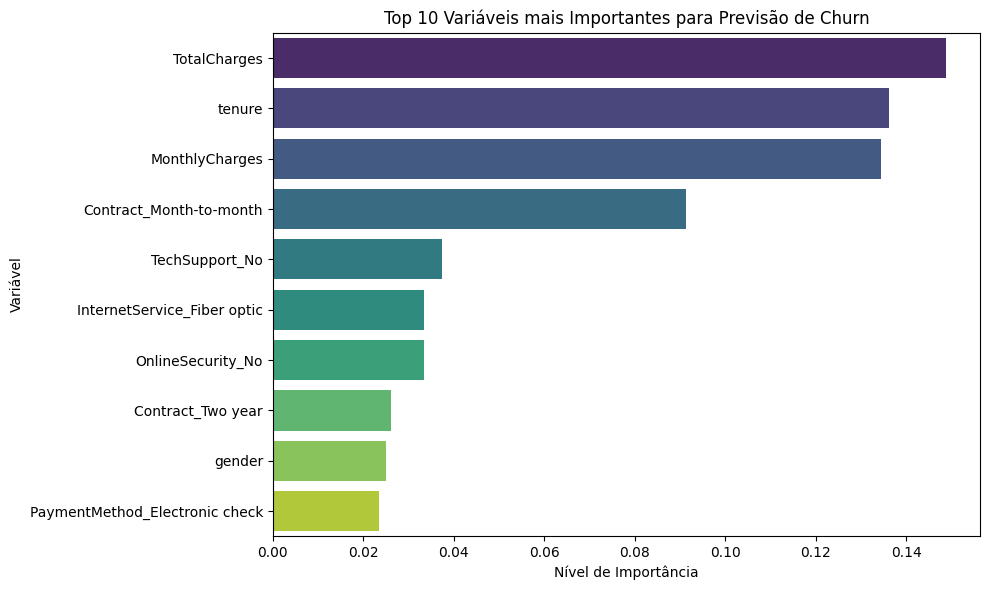

# Previsão de Churn — Telco Customer Analytics

## 📌 Visão Geral
Este projeto utiliza Machine Learning para prever a rotatividade de clientes (Churn) em uma empresa de telecomunicações. O objetivo é identificar antecipadamente clientes com alto risco de cancelamento para permitir ações preventivas de retenção.

## 📊 Principais Insights
- **Contratos Mensais:** Representam o maior fator de risco, com taxa de churn de 42,7%.
- **Tenure:** Clientes nos primeiros meses de contrato são significativamente mais propensos a sair.
- **Serviços:** Clientes de Fibra Ótica apresentam taxas de evasão acima da média da base.

## 🛠️ Tecnologias e Ferramentas
- **Linguagem:** Python 3.x
- **Bibliotecas:** Pandas, Scikit-Learn, Matplotlib, Seaborn
- **Modelo:** Random Forest Classifier

## 🚀 Como Executar
1. Clone o repositório.
2. Instale as dependências: `pip install -r requirements.txt` (opcional).
3. Execute o notebook `modelagem_churn.ipynb`.

## 📈 Conclusão
O modelo final prioriza o **Recall**, garantindo que a empresa identifique o máximo de clientes em risco. A estratégia recomendada foca na conversão de contratos mensais para anuais e no monitoramento intensivo de novos clientes.

